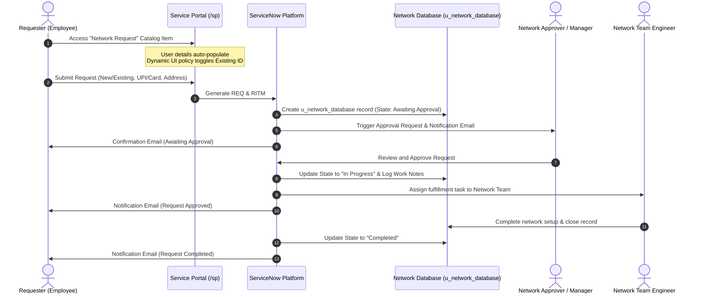

# Functional Overview: Automated Network Request Management in ServiceNow

## 1. Executive Summary
The **Automated Network Request Management** solution streamlines the end-to-end lifecycle of network-related service requests using the ServiceNow platform. By automating intake, approval routing, task orchestration, and status notifications, the system eliminates manual touchpoints, reduces fulfillment turnaround times, and provides auditable tracking.

---

## 2. Business Objectives & Benefits
* **Operational Efficiency:** Standardized intake reduces back-and-forth communication between end-users and network engineers.
* **Audit-Ready Governance:** Every network request records approvals with timestamps, approver identity, and rationale.
* **Real-Time Visibility:** Requesters and IT managers can monitor request stages from submission to completion via the Service Portal.
* **Policy Compliance:** Ensures network modifications cannot proceed without mandatory approvals and documentation.

---

## 3. Stakeholder Mapping

| Stakeholder | Role | Needs & Expectations | Impact of Automation |
| :--- | :--- | :--- | :--- |
| **End Users (Requesters)** | Submits network connection requests via Service Portal | Simple, intuitive form; auto-populated details; instant visibility into request status | Faster turnaround time; self-service transparency through `/sp` |
| **IT Administrators** | Manages catalog items, workflows, and platform integrity | Clean architecture, minimal maintenance, zero custom script debt | Reduced support ticket volume; standardized fulfillment logic |
| **Approvers (Managers / Security)** | Authorizes network access and changes | Clear business context, justification, and single-click approval | Streamlined email & portal approvals; complete audit trail |
| **Network Fulfillment Team** | Configures network devices and executes changes | Structured request payload with exact IP, device, and existing IDs | Automated task assignment; zero ambiguous or incomplete data |

---

## 4. End-to-End Functional Lifecycle

---

## 5. Form Design & Dynamic Behaviors

### Requester Information Variable Set
* **Opened on behalf of:** Reference to `sys_user` (defaults to logged-in user).
* **User Name:** Auto-populated from the selected user.
* **Email ID:** Auto-populated email address.
* **Phone Number:** Auto-populated phone/mobile number.

### Core Catalog Variables
* **Requested For:** Text input for the end-user beneficiary.
* **Mobile Number:** Mandatory contact number.
* **Type of Connection:** Multiple choice (`New` / `Existing`).
* **Enter your Existing ID:** Dynamically displayed and made mandatory **only** when `Type of Connection = Existing` via Catalog UI Policy.
* **Total Amount:** Read-only / defaulted fee (e.g., Rs. 500 or calculated).
* **Mode of Payment:** Multiple choice (`UPI` / `CARD`).
* **Address:** Physical location / server room / rack destination.
